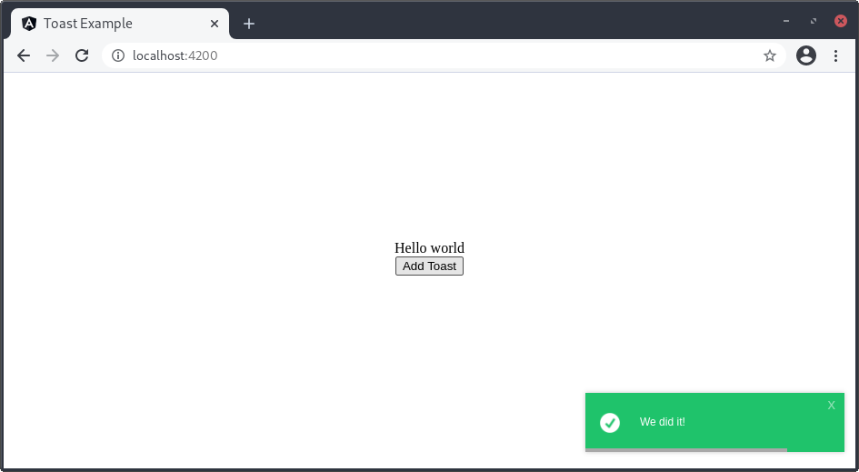
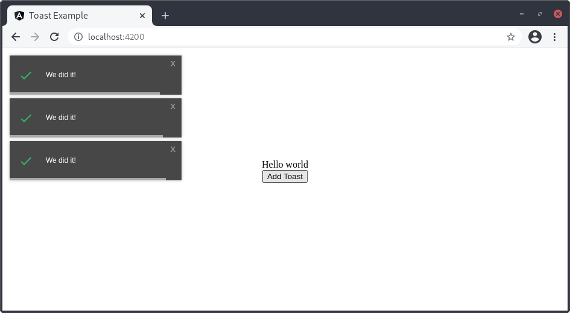
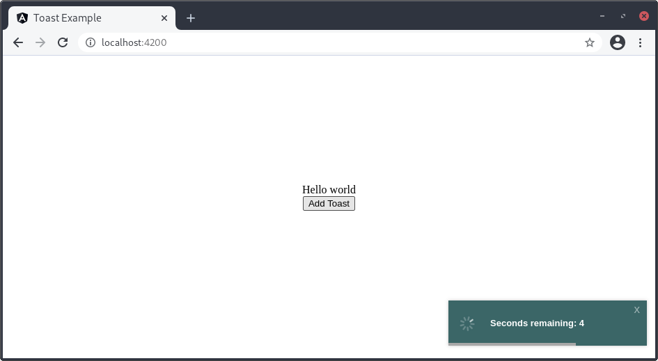

# mmm-toast [](https://badge.fury.io/js/mmm-toast) [](https://www.npmjs.com/package/mmm-toast)

An Angular toast component that shows growl-style alerts and messages for your application.
This is a continuation of the legacy previously championed by [ngx-toasta](https://github.com/emonney/ngx-toasta)
and before that [ng2-toasty](https://github.com/akserg/ng2-toasty) with the latest package versions, complete refactoring from the ground-up, and additional enhancements.

## Installation

```sh
npm i mmm-toast
```

## Demo

Online demo available [here](https://stephenwhitmore.dev/mmm-toast)

## Usage

### Table of Contents

- [Setup](#setup)
- [Models](#models)
- [Methods](#methods)
- [Examples](#examples)
- [License](#license)

### Setup

#### 1. Update the styles

- Import style into your web page. Choose one of the following files;
  - `style-default.css` - Contains DEFAULT theme
  - `style-bootstrap.css` - Contains Bootstrap 3 theme
  - `style-material.css` - Contains Material Design theme

  ```css
  /* styles.css/styles.scss - you really only need to import the one you'll use */
  @import "~mmm-toast/lib/styles/style-default.css";
  @import "~mmm-toast/lib/styles/style-bootstrap.css";
  @import "~mmm-toast/lib/styles/style-material.css";
  ```

- Assign the selected theme name [`default`, `bootstrap`, `material`] to the `theme` property of the instance of ToastaConfig.
- Add `<mmm-toast></mmm-toast>` tag in template of your application component.

#### 2. Import the `MmmToastModule`

Import `MmmToastModule` in the NgModule of your application.
The `forRoot` method is a convention for modules that provide a singleton service.

```ts
import {BrowserModule} from "@angular/platform-browser";
import {NgModule} from '@angular/core';
import {MmmToastModule} from 'mmm-toast';
import {AppComponent} from './app.component';

@NgModule({
    imports: [
        BrowserModule,
        MmmToastModule,
    ],
    bootstrap: [AppComponent]
})
export class AppModule {
}
```

If you have multiple NgModules and you use one as a shared NgModule (that you import in all of your other NgModules),
don't forget that you can use it to export the `MmmToastModule` that you imported in order to avoid having to import it multiple times.

```ts
@NgModule({
    imports: [
        BrowserModule,
        MmmToastModule,
    ],
    exports: [BrowserModule, MmmToastModule],
})
export class SharedModule {
}
```

#### 3. Use the `MmmToastService` for your application

```js
import {Component} from '@angular/core';
import {MmmToastService} from 'mmm-toast';

@Component({
  selector: 'app-root',
  templateUrl: 'app.component.html',
})
export class AppComponent {

  constructor(private mmmToastService: MmmToastService) {}
  
  ...
}
```

### Models

```js
export interface GlobalConfigModel {
  id?: number; // auto generated
  title?: string; // slightly bolder text above message
  showClose?: boolean; // shows closing 'x' on the top right of toast popup
  showDuration?: boolean; // shows shrinking bar at the bottom of the toast popup
  theme?: string; // 'bootstrap', 'default', or 'material'
  timeout?: number; // counted in miliseconds
  position?: string; // 'bottom-right', 'bottom-left', 'bottom-center', 'bottom-fullwidth', 'top-right', 'top-left', 'top-center', 'top-fullwidth', 'center-center'
  limit?: number; // how many toast popups you want to appear at a time
  isCountdown?: boolean; // change the toast popup to a countdown
}
```

```js
export interface ToastModel extends GlobalConfigModel {
  type: string; // 'error', 'info', 'success', 'wait', 'warning'
  message: string; // whatever text you want to appear in the toast popup
}
```

### Methods

#### MmmToastService

`receiveGlobalConfigs(configs: GlobalConfigModel): void {}`

Allows you to set global properties for your toasts so you don't have to set the same properties
on toasts passed in over and over. These properties are overwritten by whatever you pass into
`addToast()`.

`removeToast(toastId: number): void {}`

Will remove specific toast message you click the closing x of.

`clearAll(): void {}`

Clears out all toast messages.

`clearLast(): void {}`

Clears the last toast message to appear (LIFO so it goes from the bottom up).

`addToast(toast: ToastModel): void {}`

At minimum the `type` and `message` properties are required. Takes the ToastModel object
passed in, overwrites whatever was set as a global property. It then checks for any properties
not set and sets them to default values. After that it makes sure the limit is not surpassed and then the toast is added to the DOM.

### Examples

#### Bare Minimum

- Import `MmmToastService` from `mmm-toast` in your application code:

```js
import {Component} from '@angular/core';
import {MmmToastService} from 'mmm-toast';

@Component({
  selector: 'app-root',
  template: `
    <div>Hello world</div>
    <button (click)="addToast()">Add Toast</button>
    <mmm-toast></mmm-toast>
  `
})
export class AppComponent {

  constructor(private mmmToastService: MmmToastService) {}

  addToast() {
    this.mmmToastService.addToast({type: 'success', message: 'We did it!'})
  }
}
```

That's all you really need at a minimum. You can pass in any object that is of type
`ToastModel`. The only required properties are `type` and `message`. The default
toast properties are as follows:

```js
{
  title: '';
  showClose: true;
  showDuration: true;
  theme: 'default';
  timeout: 5000;
  position: 'bottom-right;
  limit: 5;
  isCountdown: false
}
```

Assuming you clicked the button once it would look like this:



#### Global Properties

- Import `MmmToastService` from `mmm-toast` in your application code:

```js
import {Component, OnInit} from '@angular/core';
import {MmmToastService} from 'mmm-toast';

@Component({
  selector: 'app-root',
  template: `
    <div>Hello world</div>
    <button (click)="addToast()">Add Toast</button>
    <mmm-toast></mmm-toast>
  `
})
export class AppComponent implements OnInit {

  constructor(private mmmToastService: MmmToastService) {}

  ngOnInit() {
    this.mmmToastService.receiveGlobalConfigs({
      theme: 'material',
      timeout: 10000,
      position: 'top-left',
      limit: 3,
    });
  }

  addToast() {
    this.mmmToastService.addToast({type: 'success', message: 'We did it!'})
  }
}
```

Assuming you clicked the button 3 or more times it would look like this:



#### Countdown Toast

- Import `MmmToastService` from `mmm-toast` in your application code:

```js
import {Component} from '@angular/core';
import {MmmToastService} from 'mmm-toast';

@Component({
  selector: 'app-root',
  template: `
      <div>Hello world</div>
      <button (click)="addToast()">Add Toast</button>
      <mmm-toast></mmm-toast>
  `
})
export class AppComponent {

  constructor(private mmmToastService: MmmToastService) {}

  addToast() {
    this.mmmToastService.addToast({
      type: '',
      message: '',
      isCountdown: true,
    })
  }
}
```

The countdown toast defaults to an "info" toast type:



## License

[MIT](https://github.com/stevewhitmore/mmm-toast/blob/master/LICENSE)
